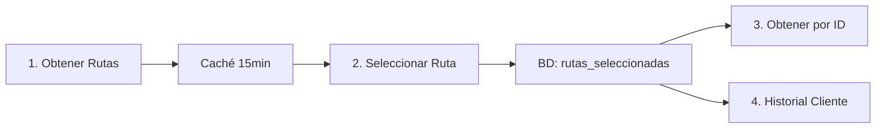

# 📮 Colección Postman - MS-Transporte

## 📥 Importar Colección

Importa el archivo: `MS-Transporte-Distancias-Complete.postman_collection.json`

## 🎯 Endpoints Disponibles

### 1️⃣ Obtener Rutas Alternativas (Cacheable)
```
GET /api/v1/distancias/rutas-alternativas
```
- **Parámetros**: `origenLat`, `origenLng`, `destinoLat`, `destinoLng`
- **Caché**: 15 minutos
- **Descripción**: Obtiene todas las rutas alternativas disponibles

### 2️⃣ Seleccionar y Guardar Ruta
```
POST /api/v1/distancias/seleccionar-ruta
```
- **Parámetros**: coordenadas + `numeroRuta` + `clienteId` (opcional) + `viajeId` (opcional)
- **Persistencia**: Guarda en BD
- **Descripción**: Selecciona una ruta específica y la guarda

### 3️⃣ Obtener Ruta por ID
```
GET /api/v1/distancias/ruta/{id}
```
- **Path Variable**: `id` (Long)
- **Descripción**: Obtiene una ruta guardada por su ID
- **Respuesta**: 200 OK o 404 Not Found

### 4️⃣ Historial de Rutas por Cliente
```
GET /api/v1/distancias/historial?clienteId=123
```
- **Parámetro**: `clienteId` (Long)
- **Descripción**: Obtiene todas las rutas de un cliente

## 🔄 Flujo de Trabajo



### Secuencia Recomendada:

1. **Llamar a "Obtener Rutas Alternativas"**
   - Primera llamada → llama a Google Maps API
   - Segunda llamada (mismas coordenadas) → responde desde caché ⚡

2. **Llamar a "Seleccionar y Guardar Ruta"**
   - Usa datos del caché (no llama API de nuevo)
   - Guarda en BD con estado `SELECCIONADA`

3. **Verificar con "Obtener Ruta por ID"**
   - Usa el `id` retornado en el paso anterior
   - Confirma que se guardó correctamente

4. **Consultar "Historial de Rutas"**
   - Ver todas las rutas del cliente
   - Incluye todas sin importar el estado

## 🧪 Tests Automatizados

Cada request incluye tests automáticos que verifican:

✅ Status code 200 OK  
✅ Estructura de respuesta correcta  
✅ Datos válidos (distancia, duración, etc.)  
✅ Tiempo de respuesta < 5 segundos  

## 📊 Variables de Colección

La colección define variables automáticas:

| Variable | Descripción | Ejemplo |
|----------|-------------|---------|
| `base_url` | URL base del servicio | `http://localhost:8082` |
| `rutaId` | ID de última ruta guardada | `1` |
| `origenLat/Lng` | Coordenadas de origen | `-31.4135, -64.1811` |
| `destinoLat/Lng` | Coordenadas de destino | `-32.9468, -60.6393` |
| `totalRutas` | Total de rutas disponibles | `3` |

## 🗺️ Ejemplos de Coordenadas

### Córdoba → Rosario
```
origenLat=-31.4135, origenLng=-64.1811
destinoLat=-32.9468, destinoLng=-60.6393
```

### Mendoza → San Juan
```
origenLat=-32.8895, origenLng=-68.8458
destinoLat=-31.5375, destinoLng=-68.5364
```

### Buenos Aires → La Plata
```
origenLat=-34.6037, origenLng=-58.3816
destinoLat=-34.9215, destinoLng=-57.9545
```

## 💡 Consejos

### Probar el Caché
1. Ejecuta "Obtener Rutas Alternativas" → verás logs de llamada a API
2. Ejecuta el mismo request de nuevo (antes de 15 min) → respuesta instantánea desde caché
3. Espera 15+ minutos → vuelve a llamar a la API

### Probar Persistencia
1. Selecciona una ruta con `clienteId=123`
2. Selecciona otra ruta con el mismo `clienteId=123`
3. Llama a "Historial" con `clienteId=123` → verás ambas rutas

### Manejo de Errores
- Si usas `numeroRuta=99` y solo hay 3 rutas → Error 500 con mensaje descriptivo
- Si buscas `rutaId=999` inexistente → 404 Not Found

## 🔍 Logs en Consola

Al ejecutar los requests, verás logs coloridos en la consola del servidor:

```
🚗 PASO 1: Consultando rutas alternativas
📍 Origen: -31.4135,-64.1811
📍 Destino: -32.9468,-60.6393
✅ 3 rutas encontradas
💾 Guardadas en CACHÉ (próxima consulta será instantánea)

💾 PASO 2: Cliente selecciona ruta #1
👤 Cliente ID: 123
🚚 Viaje ID: 456
⚡ Datos obtenidos del CACHÉ (sin llamar a Google Maps)
✅ Ruta guardada en BD con ID: 1
📊 Distancia: 395.2 km
⏱️  Duración: 280 min

🔍 Buscando ruta con ID: 1
✅ Ruta encontrada en BD
```

## 🎮 Perfiles de Aplicación

### Desarrollo (WireMock)
```bash
mvn spring-boot:run "-Dspring-boot.run.profiles=dev"
```
- Usa WireMock Cloud: `https://tpi.wiremockapi.cloud`
- No consume cuota de Google Maps
- Datos simulados

### Local (Google Maps Real)
```bash
mvn spring-boot:run "-Dspring-boot.run.profiles=local"
```
- Usa API real de Google Maps
- Requiere API Key válida
- Consume cuota ($$$)

## 📚 Documentación Adicional

- **Arquitectura**: Ver `/docs/MICROSERVICIOS.md`
- **Diagramas**: Ver `/docs/diagrams/`
- **Guía Docker**: Ver `/docs/GUIA_DOCKER.md`

---

**Creado**: Noviembre 2025  
**Versión**: 2.0 (con caché y persistencia)
