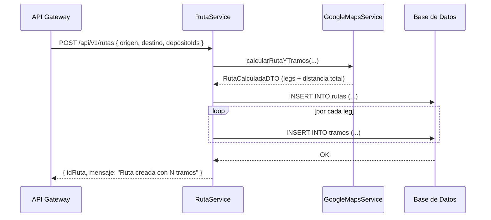

# 🚛 Módulo de Rutas y Tramos (ms-transporte)

Este módulo gestiona la **planificación automática de rutas y tramos** logísticos para el sistema de transporte.  
Integra la API de **Google Maps Directions** para calcular distancias, tiempos estimados y generar automáticamente los **tramos** que componen una **ruta**.

---

## 🧩 Conceptos principales

### 📦 Ruta
Representa el **viaje completo** desde un origen hasta un destino final asociado a una **solicitud**.  
Puede incluir múltiples depósitos intermedios (paradas o transferencias).

| Atributo | Descripción |
|-----------|-------------|
| `idRuta` | Identificador único |
| `idSolicitud` | ID lógico proveniente del microservicio de clientes |
| `distanciaTotal` | Distancia total en kilómetros |
| `cantidadTramos` | Número total de tramos |
| `cantidadDepositos` | Número de depósitos intermedios |
| `estado` | Enum: `ESTIMADA`, `ASIGNADA`, `EN_PROGRESO`, `COMPLETADA` |

---

### 🧱 Tramo
Cada **tramo** representa un segmento del recorrido entre dos puntos consecutivos.  
Por ejemplo: `Origen → Depósito`, `Depósito → Depósito`, `Depósito → Destino`.

| Atributo | Descripción |
|-----------|-------------|
| `idTramo` | Identificador único |
| `idRuta` | Ruta a la que pertenece |
| `idDepositoOrigen` | Depósito de origen (nullable) |
| `idDepositoDestino` | Depósito de destino (nullable) |
| `tipo` | Enum: `ORIGEN_DEPOSITO`, `DEPOSITO_DEPOSITO`, `DEPOSITO_DESTINO`, `ORIGEN_DESTINO` |
| `estado` | Enum: `PLANIFICADO`, `ASIGNADO`, `INICIADO`, `FINALIZADO`, `CANCELADO` |
| `distancia` | Distancia en kilómetros |
| `costoAproximado` | Costo estimado (basado en la distancia) |
| `costoReal` | Costo real al finalizar el tramo |

---

## ⚙️ Flujo de funcionamiento

### 1️⃣ Creación de una Ruta
El operador o cliente realiza un **POST** al endpoint:

```
POST /api/v1/rutas
```

**Body:**
```json
{
  "idSolicitud": 45,
  "origenLat": -31.417,
  "origenLon": -64.183,
  "destinoLat": -32.946,
  "destinoLon": -60.639,
  "depositoIds": [3, 5, 8]
}
```

> 🧭 `depositoIds` representa los depósitos intermedios elegidos en el trayecto.

---

### 2️⃣ Cálculo automático con Google Maps

El servicio `GoogleMapsService` se encarga de:
- Llamar a la API de Google Maps Directions.
- Armar la URL con origen, destino y *waypoints* (depósitos).
- Obtener la distancia total y cada *leg* (subtramo entre puntos).
- Convertir el resultado a un objeto `RutaCalculadaDTO`.

Ejemplo de respuesta interna:
```json
{
  "distanciaTotalKm": 845.3,
  "duracionTotalMin": 720,
  "legs": [
    { "depositoOrigenId": null, "depositoDestinoId": 3, "tipo": "ORIGEN_DEPOSITO", "distanciaKm": 320.1 },
    { "depositoOrigenId": 3, "depositoDestinoId": 5, "tipo": "DEPOSITO_DEPOSITO", "distanciaKm": 180.6 },
    { "depositoOrigenId": 5, "depositoDestinoId": 8, "tipo": "DEPOSITO_DEPOSITO", "distanciaKm": 150.2 },
    { "depositoOrigenId": 8, "depositoDestinoId": null, "tipo": "DEPOSITO_DESTINO", "distanciaKm": 194.4 }
  ]
}
```

---

### 3️⃣ Persistencia de la Ruta y sus Tramos

El método `RutaService.crear()`:
1. Crea la entidad **Ruta** con estado inicial `ESTIMADA`.
2. Persiste los tramos automáticamente según los *legs* recibidos.
3. Guarda la relación entre la ruta y cada tramo.

Ejemplo en base de datos:

#### Tabla `rutas`
| idRuta | idSolicitud | distanciaTotal | cantidadTramos | estado |
|--------|-------------|----------------|----------------|--------|
| 1 | 45 | 845.3 | 4 | ESTIMADA |

#### Tabla `tramos`
| idTramo | idRuta | tipo | idDepositoOrigen | idDepositoDestino | distancia | estado |
|----------|--------|------|------------------|-------------------|------------|---------|
| 1 | 1 | ORIGEN_DEPOSITO | null | 3 | 320.1 | PLANIFICADO |
| 2 | 1 | DEPOSITO_DEPOSITO | 3 | 5 | 180.6 | PLANIFICADO |
| 3 | 1 | DEPOSITO_DEPOSITO | 5 | 8 | 150.2 | PLANIFICADO |
| 4 | 1 | DEPOSITO_DESTINO | 8 | null | 194.4 | PLANIFICADO |

---

### 4️⃣ Recalculo dinámico del estado de la Ruta

Cada vez que se **actualiza un tramo** (inicio, fin o cancelación), el sistema llama:

```java
rutaService.recalcularDesdeTramos(idRuta);
```

Este método:
- Suma las distancias de los tramos no cancelados.
- Ajusta el estado general de la ruta según el progreso:

| Estado de tramos | Estado de la ruta |
|------------------|------------------|
| Todos planificados | `ESTIMADA` |
| Alguno asignado | `ASIGNADA` |
| Alguno iniciado | `EN_PROGRESO` |
| Todos finalizados | `COMPLETADA` |

---

## 🧠 Diagrama conceptual



---

## 📘 Endpoints principales

### 🛣️ Rutas

| Método | Endpoint | Roles | Descripción |
|--------|-----------|-------|-------------|
| `GET` | `/api/v1/rutas` | OPERADOR, ADMIN | Lista todas las rutas |
| `GET` | `/api/v1/rutas/{id}` | OPERADOR | Obtiene una ruta específica |
| `GET` | `/api/v1/rutas/solicitud/{idSolicitud}` | OPERADOR, CLIENTE | Busca ruta asociada a una solicitud |
| `POST` | `/api/v1/rutas` | OPERADOR | Crea una nueva ruta (automática) |

---

### 🧭 Tramos

| Método | Endpoint | Roles | Descripción |
|--------|-----------|-------|-------------|
| `GET` | `/api/v1/tramos` | OPERADOR | Lista todos los tramos |
| `GET` | `/api/v1/tramos/{id}` | TRANSPORTISTA | Obtiene un tramo específico |
| `GET` | `/api/v1/tramos/ruta/{idRuta}` | OPERADOR | Lista tramos de una ruta |
| `POST` | `/api/v1/tramos` | OPERADOR | Crea tramo manual (solo si no fue autogenerado) |
| `PUT` | `/api/v1/tramos/{id}` | OPERADOR | Actualiza tramo si está `PLANIFICADO` |
| `DELETE` | `/api/v1/tramos/{id}` | OPERADOR | Elimina tramo si no fue iniciado |
| `POST` | `/api/v1/tramos/{id}/iniciar` | TRANSPORTISTA | Marca inicio de tramo |
| `POST` | `/api/v1/tramos/{id}/finalizar` | TRANSPORTISTA | Marca fin del tramo y calcula costo real |

---

## 🧮 Lógica de cálculo de costos

Por ahora, el costo estimado de cada tramo se calcula como:

```
costoAproximado = distanciaKm * 1.00
```

> 🧩 En futuras versiones se integrará una **tarifa dinámica** según tipo de camión, combustible y condiciones de ruta.

---

## 🧰 Dependencias principales

- `Spring Boot 3.x`
- `Spring Data JPA`
- `Spring Web`
- `Lombok`
- `Jakarta Validation`
- `Google Maps Directions API`
- `PostgreSQL`

---

## 🧾 Autor
**Francisco Andrade**  
Backend — Ingeniería en Sistemas de Información (UTN-FRC)  
📚 Proyecto académico “Logística de Transporte - ms_transporte”
